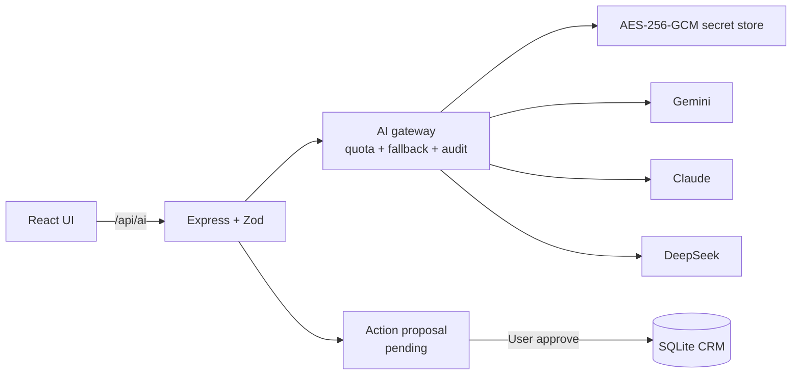

# AI Copilot — kiến trúc và vận hành

## Phạm vi đã triển khai

### Giai đoạn 1 — nền tảng và trải nghiệm theo ngữ cảnh

- Gemini, Anthropic Claude và DeepSeek qua adapter riêng; không phụ thuộc SDK của provider.
- API key cấu hình từ UI, mã hóa AES-256-GCM tại server.
- Đồng bộ model trực tiếp từ Models API và lưu capability chuẩn hóa.
- Ba profile model: nhanh, cân bằng, suy luận.
- AI Brief cho Dashboard, hồ sơ khách hàng và cơ hội.
- Chuyển ghi chú tương tác tự do thành summary, result, Next Action và ngày thực hiện.

### Giai đoạn 2 — hành động an toàn và kiểm soát vận hành

- Gateway fallback qua các provider đang sẵn sàng.
- Quota token/ngày, ngân sách/ngày, log độ trễ, lỗi và chi phí ước tính.
- Đơn giá input/output token do quản trị cấu hình vì giá provider thay đổi theo thời gian.
- AI chỉ tạo `ai_action_proposals`. Hành động tạo task/reminder/interaction hoặc cập nhật Next Action
  chỉ chạy sau request duyệt riêng của người dùng; payload được kiểm tra lại bằng Zod và chạy trong
  transaction.
- Feedback và request ID phục vụ đánh giá chất lượng prompt/model.

### Giai đoạn 3 — RAG, hỏi đáp và automation

- Tệp text/Markdown/CSV/JSON/XML/HTML tối đa 5 MB được chia đoạn và lập chỉ mục FTS5 local.
- PDF, DOCX và XLSX được trích xuất nội dung thật (`services/ai/textExtract.ts`) rồi mới lập chỉ mục.
  PDF dùng `pdfjs-dist` (tối đa 60 trang, không đọc font hệ thống, không gọi mạng), DOCX dùng
  `mammoth`, XLSX dùng bộ đọc ZIP tự viết trên `node:zlib` — SheetJS bị loại vì có lỗ hổng chưa vá
  trên đúng bề mặt tấn công này. Định dạng còn lại vẫn lập chỉ mục bằng metadata.
- Lập chỉ mục chạy nền sau khi upload trả về: đọc PDF mất vài giây, không được giữ chân phản hồi.
- Tài liệu có `confidentiality = confidential` không xuất hiện trong kết quả RAG gửi tới LLM.
- Trang *Trợ lý AI* hỏi kết hợp CRM và tài liệu, hiển thị nguồn và đề xuất action cần duyệt.
- Automation pipeline risk, Next Action quá hạn, hợp đồng sắp hết hạn và daily brief chạy định kỳ,
  chỉ tạo notification; không tự sửa dữ liệu CRM.

## Luồng bảo mật

- Base URL phải là HTTPS, ngoại trừ localhost dùng cho phát triển/test.
- Key không ghi log, không xuất JSON và client chỉ nhận bốn ký tự cuối.
- Nếu không có `WORKFLOW_AI_MASTER_KEY`, server tạo `.ai-master.key` với quyền file hạn chế trong
  `WORKFLOW_DATA_DIR`. Sao lưu/di chuyển key này cùng thư mục dữ liệu nếu muốn giữ cấu hình provider.
- Nội dung đưa vào prompt được chọn theo allowlist, giới hạn kích thước và bỏ tài liệu mật.
- Không hiển thị chain-of-thought của model; chỉ dùng nội dung trả lời cuối.

## Giới hạn có chủ đích

- Ứng dụng hiện là local-first một người dùng, chưa có RBAC. Không mở API ra Internet trước khi bổ
  sung đăng nhập, CSRF/rate limit và phân quyền admin cho cấu hình provider.
- Chi phí chỉ là ước tính khi đã cấu hình đơn giá trên mỗi triệu token.
- PDF scan / ảnh không tách được chữ: chỉ khi đó tệp mới được gửi thẳng cho model đọc được tài liệu
  (Gemini, Claude — DeepSeek không hỗ trợ) và chỉ với tệp ≤ 10 MB.
