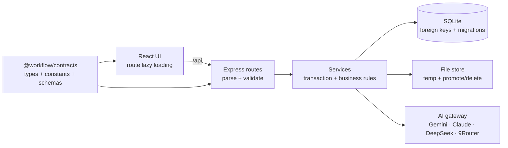

# Kiến trúc WorkFlow

## Tổng quan

WorkFlow là ứng dụng nhiều người dùng có phân cấp quản lý. Client React giao tiếp với Express qua
JSON API; Express lưu dữ liệu đồng bộ vào SQLite và file đính kèm trên cùng ổ đĩa.

## Ranh giới module

- `packages/contracts`: giá trị enum, kiểu và schema thực sự dùng ở cả client lẫn server. Thay đổi
  contract phải build workspace này trước khi chạy code runtime.
- `server/src/routes`: biên HTTP; đọc path/query/body, gọi validation/service và tạo response.
- `server/src/services`: thao tác nhiều bước phải có transaction hoặc quy tắc cleanup. Hiện gồm
  chuyển thẻ, chuyển/chấm deal, vòng đời tài liệu và merge doanh thu.
- `server/src/lib`: helper thuần hoặc hạ tầng dùng chung như position, liên kết entity, tìm kiếm và
  scoring.
- `client/src/pages`: orchestration theo route. Tất cả page được lazy-load.
- `client/src/components`: UI theo miền; modal thẻ và popover được tách để giới hạn blast radius.
- `client/src/lib/dnd`: clone/locate/tính lại trạng thái optimistic cho Board và Pipeline.

## Tính nhất quán dữ liệu

- SQLite bật foreign key và WAL cho DB trên đĩa.
- Mọi liên kết contact/deal/contract/quotation/card/service được kiểm tra tồn tại và cùng customer
  trước khi ghi.
- **Người phụ trách là trục riêng, cố ý không đi qua `assertEntityLinks`** (`resolveAssignee` trong
  `lib/entityRelations.ts`). Nhóm khoá kia trả lời "việc này *về* cái gì" và bắt buộc cùng một khách
  hàng; người phụ trách trả lời "*ai* làm" và câu trả lời thường nằm ngoài phạm vi đó — việc về khách
  hàng A phần lớn do nhân sự công ty mình làm. Gộp hai trục lại sẽ khiến mọi task giao nội bộ bị từ
  chối 422 `CROSS_CUSTOMER_LINK`. `cards.assignee_org_id` luôn suy ra từ contact ở máy chủ, không bao
  giờ nhận từ client, để hai cột không bao giờ lệch nhau.
- **Cột Kanban và vòng đời nối với nhau bằng `lists.status_mapping`, không bằng suy đoán.** Trước v19,
  bốn cột mặc định trùng tên với bốn trạng thái nhưng hoàn toàn độc lập, và có thêm một heuristic đoán
  trạng thái từ *tên cột* — ba nguồn sự thật cho cùng một thứ. Nay cột tự khai báo nó nghĩa là gì:
  `moveCard` đọc ánh xạ của cột đích rồi gọi `setCardStatus`, và `setCardStatus` kéo thẻ sang cột mang
  đúng trạng thái đó. Đệ quy giữa hai hàm được chặn bằng **cờ tường minh** `opts.moveToMappedList`
  (không dùng biến trạng thái toàn cục) — bên gọi biết thẻ đã ở đúng cột thì tắt cờ. Cột `status_mapping
  = NULL` không đụng đến vòng đời, nên vẫn xếp thẻ tự do kiểu Trello được.
- **Dự án của một công việc suy từ `boards.project_id`, không có cột riêng trên `cards`.** v17 từng có
  `cards.project_id` như một bản sao, với bốn đường ghi và hai luật mâu thuẫn (form cho ghi đè,
  `moveCard` ghi đè lại) — kết quả là thẻ mang dự án A trong khi nằm ở bảng của dự án B, và không màn
  hình nào làm lộ ra. v19 xóa hẳn cột: không có bản sao thì không thể lệch. Đổi dự án của một việc =
  chuyển nó sang bảng khác. `createTaskInputSchema.project_id` vẫn còn nhưng **chỉ để chọn bảng mặc
  định** (`resolveDefaultList`), không bao giờ được ghi xuống thẻ.
- **`cards.is_done` và `cards.status` ràng buộc nhau bằng bất biến `is_done = 1 ⇔ status = 'done'`.**
  `is_done` được đọc ở gần 80 truy vấn có sẵn nên không thể bỏ; `status` là thứ người dùng thực sự
  làm việc cùng. `setCardStatus()` trong `services/cardService.ts` là **đường ghi duy nhất** cho cả
  hai cột, đồng thời phụ trách `completed_at`, `blocked_since`/`blocked_reason` và việc sinh bản kế
  tiếp cho công việc lặp lại. Mọi chỗ khác (route cards, checklist, seed) phải đi qua nó — hoặc, với
  seed vốn chèn thẳng SQL, phải tự suy `status` ngay tại chỗ ghi.
- **Chỉ số dự án và sức khỏe được tính khi đọc, không có cột lưu.** Chúng phụ thuộc vào ngày hôm nay,
  nên một giá trị lưu sẵn sẽ sai vào hôm sau mà không có sự kiện nào để kích hoạt cập nhật.
- **Phụ thuộc công việc bị chặn chu trình tại chỗ ghi** (`addDependency`, DFS). SQLite không diễn tả
  được ràng buộc "đồ thị không có chu trình", và một chu trình sẽ làm mọi thuật toán duyệt sau này
  (vẽ đường nối trên Timeline) lặp vô hạn.
- **`cards.baseline_due_date` chốt ở lần đặt hạn đầu tiên và không bao giờ ghi đè**; mỗi lần đổi hạn
  sau đó ghi một dòng `card_due_changes`. Nhờ vậy độ trượt tiến độ là con số đo được thay vì biến mất.
- `customers.org_kind` phân tách sổ danh bạ tổ chức khỏi danh sách khách hàng. **Mọi truy vấn liệt kê
  khách hàng phải lọc `org_kind = 'customer'`** — quên một chỗ là "công ty tôi" lọt vào pipeline,
  doanh thu, báo cáo và cảnh báo AI như một khách hàng thật.
- Reorder chỉ chấp nhận `beforeId`/`afterId` thuộc đúng list, board, card hoặc stage; chính item đang
  di chuyển không được làm hàng xóm. Khoảng position quá nhỏ được chuẩn hóa lại trong transaction.
- Chuyển stage và side effect của scorecard chạy trong cùng transaction. Ghi đè stage gate bắt buộc
  lý do và có history.
- Upload chuyển file từ thư mục tạm sang kho chính rồi mới commit metadata; mọi lỗi validation/DB
  xóa cả bản tạm lẫn bản đã promote. Delete đảo ngược được cho tới khi DB commit thành công.

## Migration và dữ liệu runtime

`server/src/db/migrate.ts` nâng tuần tự từ schema cũ lên phiên bản hiện tại (v40). Test chạy các
fixture v1, v4, v7, v9, v10, v14 và v18 lên phiên bản mới nhất để phát hiện mất dữ liệu, và khẳng định các
mặc định của v15 (khách hàng cũ vẫn là `org_kind = 'customer'`, người liên hệ cũ vẫn `is_active = 1`).
Đường dẫn runtime được điều khiển bằng `WORKFLOW_DATA_DIR` và `WORKFLOW_DB_PATH`; test dùng DB bộ nhớ
hoặc thư mục tạm cách ly.

Năm phiên bản gần nhất: v37 phiên trò chuyện với Trợ lý AI · v38 nhiều người dùng và đăng nhập bằng
email · v39 cây đơn vị, vị trí và ma trận phân quyền · v40 chủ sở hữu bản ghi (phân quyền dữ liệu) ·
v41 phiên trò chuyện AI thuộc về một người dùng.

v19 có hai điểm cần lưu ý khi đọc migration: `DROP COLUMN` chỉ chạy được sau khi **xóa index tham
chiếu tới cột đó** (SQLite từ chối bỏ cột còn index trỏ vào), và backfill `status_mapping` phải làm ở
TypeScript vì SQLite không bỏ dấu tiếng Việt được — cột nào không khớp mẫu nào để `NULL` thay vì đoán
bừa, vì đoán sai nghĩa là kéo thẻ vào đó sẽ âm thầm đổi trạng thái không đúng ý người dùng.

## Kiểm thử và phát hành

Quality gate là `npm run check`: Prettier, ESLint, TypeScript, unit/integration/migration test,
production build, bundle budget và Playwright E2E. E2E chạy production client bằng Chromium ở
desktop và mobile, xác minh route/deep-link/search cùng tràn ngang trên Dashboard và Board.

## Phân cấp quản lý và phân quyền (v38–v40)

**CEO / Giám đốc Trung tâm / Giám đốc Khối / Trưởng phòng không phải bốn loại vị trí khác nhau.**
Chúng là *cùng một* loại — "quản lý đơn vị" — đặt ở *độ sâu khác nhau* trong `org_units`. Ba vị trí
quản lý được seed với bộ quyền **giống hệt nhau**; đó không phải trùng lặp cần gom mà là bằng chứng
mô hình đúng, và `server/src/test/permissions.test.ts` khẳng định nó bằng một phép so chuỗi. Mã hoá
cứng bốn cấp thì thêm cấp thứ năm phải sửa code; với cây `parent_id` thì chỉ là thêm một node.

Ba trục tách rời, cố ý không gộp:

- **`org_units`** trả lời *dữ liệu của ai* — cây độ sâu tuỳ ý. `contacts.org_unit_id` là **nguồn sự
  thật duy nhất** về chỗ ngồi; đơn vị một quản lý phụ trách *chính là* đơn vị họ ngồi, nên không nhân
  bản cột đơn vị sang `user_positions`.
- **`positions` + `position_permissions`** trả lời *được làm gì*. Là **dữ liệu**, sửa lúc chạy. Danh
  mục `resource × action × scope` thì nằm trong code (`packages/contracts/src/permissions.ts`) vì một
  resource không có màn hình và endpoint thì có tạo trong CSDL cũng vô nghĩa.
- **`org_unit_kinds`** (Công ty/Trung tâm/Khối/Phòng/Tổ) chỉ là **nhãn hiển thị**. Trộn nó vào quyền
  sẽ sinh ra câu hỏi vô nghĩa kiểu "Khối có nhiều quyền hơn Phòng không".

Hai lớp chặn độc lập, đều cần thiết:

| Lớp | Ở đâu | Trả lời |
|---|---|---|
| Tính năng | `requireResource()` cạnh danh sách mount trong `app.ts` | Vào được màn hình nào |
| Dữ liệu | `lib/scope.ts`, ghép vào từng truy vấn | Trong màn hình đó thấy dòng nào |

- **`position_permissions` lưu thưa**: không có dòng nghĩa là `none`. Nhờ vậy thêm một resource mới
  trong tương lai mặc định là **cấm** với mọi vị trí cũ, không phải cho.
- **Không cache quyền xuyên request.** `Access` tính lại mỗi request; đổi một ô là request kế tiếp đã
  theo quyền mới. Một cache quyền là một nguồn lệch, và lệch ở đây nghĩa là ai đó nhìn thấy dữ liệu
  không được phép.
- **Chỉ bảng gốc mang `owner_contact_id`** (`customers`, `deals`, `boards`, `customer_services` + bốn
  bảng cá nhân). Mọi bảng con suy phạm vi qua JOIN sẵn có — cùng lý do `cards.project_id` bị xoá hẳn ở
  v19: không có bản sao thì không thể lệch.
- **Ngoài phạm vi trả 404, không phải 403.** Phân biệt "không tồn tại" với "không được xem" sẽ biến
  việc dò id thành cách xem ai đang có dữ liệu gì.
- **Hai ngoại lệ có chủ ý, đều có test:** việc *giao cho mình* luôn mở được dù nằm trên bảng người
  khác (phân quyền không được chặn đường làm việc bình thường), và *ghi chú là dữ liệu cá nhân* nên
  cấp trên không đọc được — đọc sổ nháp của nhân viên là giám sát, không phải quản lý, và nó sẽ làm
  người ta ngừng ghi thật.
- **`services/ai/contextBuilder.ts` phải lọc theo phạm vi người hỏi.** Đây là đường rò rỉ nguy hiểm
  nhất: không màn hình nào làm lộ ra, nhưng một câu hỏi thường là moi được dữ liệu phòng khác. Mọi
  truy vấn dựng ngữ cảnh đều ở trong tệp đó và đều nhận `AiScopes` — **một phạm vi cho mỗi loại dữ
  liệu**, không phải một thước đo chung: người xem được hợp đồng mà không xem được pipeline phải
  thấy đúng như vậy khi hỏi. Lưới an toàn là `server/src/test/aiScope.test.ts`.
- **Phiên trò chuyện với trợ lý là dữ liệu cá nhân** (`ai_chat_sessions.user_id`, v41). Nội dung trả
  lời được sinh ra từ phạm vi của *người hỏi*, nên một phiên của giám đốc nằm trong danh sách của
  nhân viên là rò rỉ ngay cả khi không ai bấm vào. Giới hạn 20 phiên cũng tính trên mỗi người —
  giới hạn chung sẽ khiến vài người dùng cùng lúc đẩy lịch sử của nhau ra ngoài.

Không có seam chung cho 853 câu `.prepare(` trong server, nên lưới an toàn là
`server/src/test/dataScope.test.ts` — đếm **đúng số dòng** cho từng vị trí trên từng endpoint. Kỷ luật
một mình đã từng không đủ: luật `org_kind = 'customer'` cùng loại và đã bị quên ở vài chỗ.

Module công nợ đầy đủ (hoá đơn, phiếu thu, tuổi nợ) là nợ kỹ thuật đã thống nhất hoãn — xem
[TECH-DEBT-CONG-NO.md](TECH-DEBT-CONG-NO.md).
