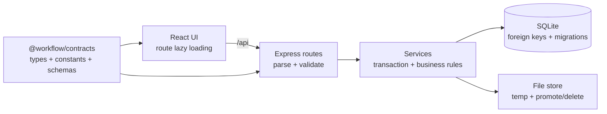

# Kiến trúc WorkFlow

## Tổng quan

WorkFlow là ứng dụng local-first cho một người dùng. Client React giao tiếp với Express qua JSON
API; Express lưu dữ liệu đồng bộ vào SQLite và file đính kèm trên cùng ổ đĩa.

## Ranh giới module

- `packages/contracts`: giá trị enum, kiểu và schema thực sự dùng ở cả client lẫn server. Thay đổi
  contract phải build workspace này trước khi chạy code runtime.
- `server/src/routes`: biên HTTP; đọc path/query/body, gọi validation/service và tạo response.
- `server/src/services`: thao tác nhiều bước phải có transaction hoặc quy tắc cleanup. Hiện gồm
  chuyển thẻ, chuyển/chấm deal, vòng đời tài liệu và merge doanh thu.
- `server/src/lib`: helper thuần hoặc hạ tầng dùng chung như position, liên kết entity, tìm kiếm và
  scoring.
- `client/src/pages`: orchestration theo route. Tất cả page được lazy-load.
- `client/src/components`: UI theo miền; modal thẻ và popover được tách để giới hạn blast radius.
- `client/src/lib/dnd`: clone/locate/tính lại trạng thái optimistic cho Board và Pipeline.

## Tính nhất quán dữ liệu

- SQLite bật foreign key và WAL cho DB trên đĩa.
- Mọi liên kết contact/deal/contract/quotation/card/service được kiểm tra tồn tại và cùng customer
  trước khi ghi.
- Reorder chỉ chấp nhận `beforeId`/`afterId` thuộc đúng list, board, card hoặc stage; chính item đang
  di chuyển không được làm hàng xóm. Khoảng position quá nhỏ được chuẩn hóa lại trong transaction.
- Chuyển stage và side effect của scorecard chạy trong cùng transaction. Ghi đè stage gate bắt buộc
  lý do và có history.
- Upload chuyển file từ thư mục tạm sang kho chính rồi mới commit metadata; mọi lỗi validation/DB
  xóa cả bản tạm lẫn bản đã promote. Delete đảo ngược được cho tới khi DB commit thành công.

## Migration và dữ liệu runtime

`server/src/db/migrate.ts` nâng tuần tự từ schema cũ lên phiên bản hiện tại. Test chạy các fixture
v1, v4, v7, v9 và v10 lên v11 để phát hiện mất dữ liệu. Đường dẫn runtime được điều khiển bằng
`WORKFLOW_DATA_DIR` và `WORKFLOW_DB_PATH`; test dùng DB bộ nhớ hoặc thư mục tạm cách ly.

## Kiểm thử và phát hành

Quality gate là `npm run check`: Prettier, ESLint, TypeScript, unit/integration/migration test,
production build, bundle budget và Playwright E2E. E2E chạy production client bằng Chromium ở
desktop và mobile, xác minh route/deep-link/search cùng tràn ngang trên Dashboard và Board.

Phần bảo mật được chủ động để ngoài phạm vi đợt nâng cấp này theo quyết định sản phẩm; cần một đợt
threat modeling và hardening riêng trước khi thay đổi mô hình local một người dùng hoặc đưa dịch vụ
ra mạng công cộng.
